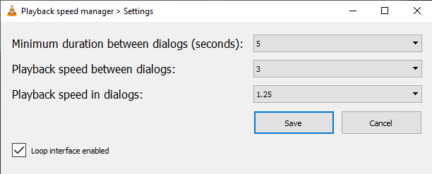

# Dynamic-Adjustment-of-Playback-Speed

This VLC extension increases the playback speed between the dialogues to save you time.
This extension works with video subtitles and assumes the subtitles are synchronized to the video.

**Motivation** - Academy Awards committees tend to reward long films over shorter ones, and thus sometimes, directors and studios aim for longer running times (Source: ["No Time to Pee – why today’s blockbusters are just too long"](https://www.independent.co.uk/arts-entertainment/films/features/long-blockbusters-no-time-to-die-b1938980.html)). 

**English and non-English subtitles** can be used. 
Non-English subtitles should be encoded with UTF-8 with BOM.
To do so, open your subtitles with Notepad, click on "save as," and then change the encoding to UTF-8 with BOM.

The code was initially written by Michele Gaiarin  ([gaiazdev@gmail.com](gaiazdev@gmail.com)) and Simone Gaiarin ([simgunz@gmail.com](simgunz@gmail.com)) and can be found on Github: 
[Playback Speed Manager](https://github.com/ilgaiaz/playback-speed-manager).
I forked the project to modify this extension and add with my ideas.

## My Modifications
* Adding the option to the user to determine the minimum duration between dialogues before speeding up (for example, 10 seconds means that the dialogue should be with no subtitles for 10 seconds). Initially, it was defined automatically and statically to 3 seconds (the user could not use this parameter).
* Ignoring music by skipping subtitles that include the character "♪", which means they consider as "between dialogues".
* Ignoring square brackets ("[" and "]"), which indicate a song title or sound effect description - consider as "between dialogues".
* Adding playback speed options of x1.25 and x1.5 in dialogues.
* Smoothing the playback speed increasing\decreasing
  - Increasing the playback speed a couple of seconds after the current subtitle presents to allow the user to read the subtitle, in which the number of seconds depends on the pre-defined maximum playback speed.
  - Decreasing the playback speed a couple of seconds before the next subtitle allows the user to read the current subtitle, in which the number of seconds depends on the pre-defined maximum playback speed.

## Things To Do
* Fixing the VLC freezing issue. Every time the playback speed changes, the video freezes for a second. This problem is more noticeable when the difference between the playback speeds is higher (e.g., changing from 1x to 4x, or vice versa). It is a problem with VLC, not with this extension, still frustrating.
* Writing a regex for music, song title, sound effect description, or more things (?).
* Adding to option to the user decide whether to ignore the music, song title, or sound effect description or not.

# Playback Speed Manager's README (The Original Repository)

It was initially developed with the purpose to facilitating a user with the listening of a new language by reducing the speed during a dialogue.  
It was later modified to use it as the extension [Time Saver](https://addons.videolan.org/content/show.php?content=169314) (that is no more available on VLC 3.0).

So now this VLC Addon give the possibility to :

1. Set the speed of the video when there are no subtitles.
2. Set the speed of the video when a subtitle is shown on the screen.

The developed code was obtained starting from the work of the user "mederi" which can be found [here](https://addons.videolan.org/p/1154032/).

## Installation
Put the file `playback_speed_manager.lua` in :  

- **Windows (all users)**
%ProgramFiles%\VideoLAN\VLC\lua\extensions\

- **Windows (current user)**
%APPDATA%\VLC\lua\extensions\

- **Linux (all users)**
/usr/lib/vlc/lua/extensions/

- **Linux (current user)**
~/.local/share/vlc/lua/extensions/

- **Mac OS X (all users)**
/Applications/VLC.app/Contents/MacOS/share/lua/extensions/

- **Mac OS X (current user)**
/Users/%your_name%/Library/ApplicationSupport/org.videolan.vlc/lua/extensions/

Put `psm_looper_intf.lua` in :  

- **Windows (all users)**
%ProgramFiles%\VideoLAN\VLC\lua\intf\

- **Windows (current user)**
%APPDATA%\VLC\lua\intf\

- **Linux (all users)**
/usr/lib/vlc/lua/intf/

- **Linux (current user)**
~/.local/share/vlc/lua/intf/

- **Mac OS X (all users)**
/Applications/VLC.app/Contents/MacOS/share/lua/intf/

- **Mac OS X (current user)**
/Users/%your_name%/Library/ApplicationSupport/org.videolan.vlc/lua/intf/

At the end, restart VLC.

Note: create the directories if they do not exist.

## How to use
Rename the subtitle file with the name of the video and place it in the same folder.
Open the desired video, go to "view" and select the "slowsub" extension.

In the interface it will be possible to select two values ​​from dropdown menus:

- **Playback speed (no subtitles)**
Allows you to select the playback speed when there are no dialogues (no subtitles).

- **Playback speed (subtitles)**
Allows you to select the playback speed when subtitle are displayed.

## First use
On first use, the extension will ask to enable the "Loop interface". 
All you have to do is give permission and restart VLC (the procedure is guided). From the following times, this phase will no longer be necessary.  
This procedure is required to enable the script `psm_looper_intf.lua`. From this moment the script will be activated in the background at every VLC execution.

## Disable
Every time VLC or the extension is closed the parameters are set to the standard value. If you want to completely disable the extension (in particular the script `psm_looper_intf.lua`), you must uncheck the "Loop interface" checkbox, confirm and restart VLC.  
To re-enable the extension it is necessary to follow what is explained in the section "First use".

## Interface
Below is possible to see a preview of the interface.

# Authors
Michele Gaiarin  ([gaiazdev@gmail.com](gaiazdev@gmail.com)), Simone Gaiarin ([simgunz@gmail.com](simgunz@gmail.com))

# License
This extension is released under the [GNU General Public License (GPLv3)](https://www.gnu.org/licenses/gpl-3.0.html)
